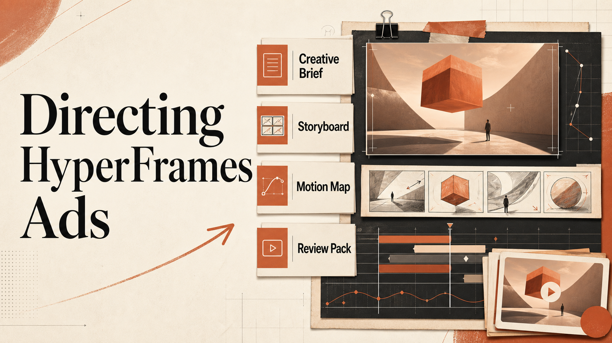
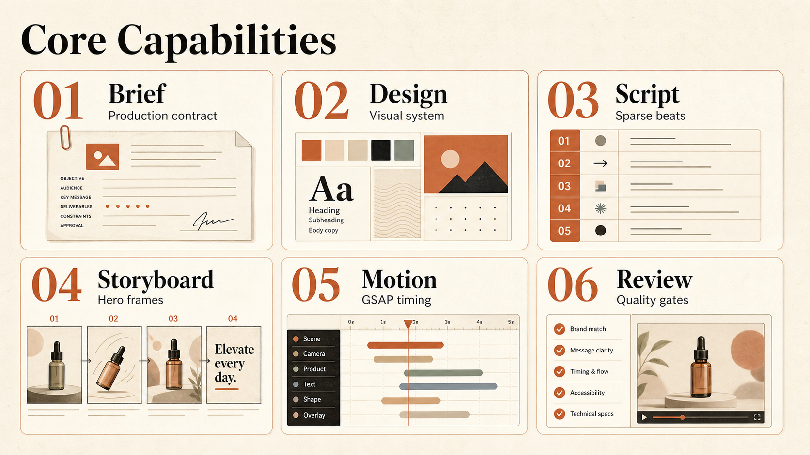

<div align="center">

# HyperFrames Motion Director

**An Agent Skill for planning, producing, and reviewing HyperFrames motion videos.**



[](./LICENSE)
[](./SKILL.md)
[](https://nodejs.org/)

</div>

## What It Is

HyperFrames Motion Director is an Agent Skill for turning a product story, article, README, website, or launch message into a structured HyperFrames motion-video production.

It defaults to Chinese-first vertical promo videos: `9:16`, `1080x1920`, concise screen copy, controlled visual assets, readable hold frames, and a review step before delivery.

The skill keeps production in two phases:

1. Create a brief/design proposal and wait for confirmation.
2. Generate assets, build the composition, validate snapshots/renders, and write a review report.

## Install

```bash
npx skills add geekjourneyx/hyperframes-motion-director
```

## Use

After installation, ask your Agent for a HyperFrames motion video, product launch film, article-to-video piece, or kinetic typography promo.

Example:

```text
Turn this README into a 12-second Chinese vertical HyperFrames promo.
Start with the brief/design proposal and wait for confirmation.
```

## Local Development

Create a motion-video production scaffold from this repository:

```bash
node scripts/create_project.mjs ./my-motion-film
```

Create a project with timing and motion maps:

```bash
node scripts/create_project.mjs ./my-motion-film --with-timing --with-motion
```

## Outputs

The scaffold creates four core production files:

```text
BRIEF_DESIGN_PROPOSAL.md  Direction, format, visual plan, motion plan
DESIGN.md                 Visual system, asset rules, layout contracts
STORYBOARD.md             Beats, screen copy, timing, transitions
REVIEW_REPORT.md          Checks, snapshots, issues, remaining risks
```

It also creates three design-engineering contracts:

```text
SCENE_SCHEMA.json         Structured scenes, slots, layout contracts, timing, snapshots
VECTOR_TEMPLATES.json     Approved SVG scene systems, icon/decor rules, rejection tests
MOTION_PRIMITIVES.json    Approved GSAP/SVG/CSS motion vocabulary, plugin policy, selection rules
```

Optional files:

```text
BEAT_MAP.json             Music, voiceover, or exact timing map
MOTION_MAP.json           GSAP choreography and transition map
```

## What It Enforces



- A confirmed brief before implementation.
- Chinese vertical-video defaults, with documented overrides for other platforms.
- Image Gen assets with a clear role, quiet text zone, crop-safe area, and local path.
- Text-over-background layout contracts before animation.
- Scene schema, vector template, and motion primitive contracts before implementation.
- GSAP choreography contracts: labels, position parameters, plugin registration, transform aliases, and performance rules.
- Motion that guides attention instead of repeating static slide patterns.
- Validation, snapshots, and review notes before final delivery.
- Compact artifact writing: no self-talk, generic pitch language, or unrelated commentary.

## Validate This Skill

Check the skill package:

```bash
node scripts/check-structure.mjs
```

Check a generated project:

```bash
node scripts/check_assets.mjs <project-dir>
node scripts/check_assets.mjs <project-dir> --strict
node scripts/validate_artifacts.mjs <project-dir>
node scripts/validate_design_engineering.mjs <project-dir>
```

For implemented HyperFrames compositions, also run the strongest checks supported by the local HyperFrames CLI, such as validate, inspect, snapshot, and render.

## Repository Structure

```text
SKILL.md             Main Agent Skill instructions
templates/           Brief, design, storyboard, review, schema, vector, motion maps
references/          Workflow, visual standards, design engineering, GSAP choreography, layout, audio sync, stability
scripts/             Project scaffold and validation helpers
evals/               Trigger prompts and evaluation cases
assets/              README visual assets
```

## Author

- Website: [jieni.ai](https://jieni.ai)
- GitHub: [geekjourneyx](https://github.com/geekjourneyx)
- X: [@seekjourney](https://x.com/seekjourney)
- WeChat Official Account: 极客杰尼

## License

[GNU Affero General Public License v3.0](./LICENSE)
